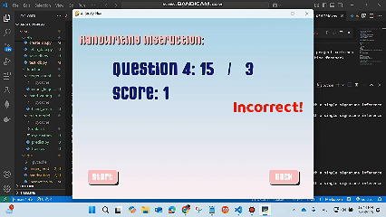
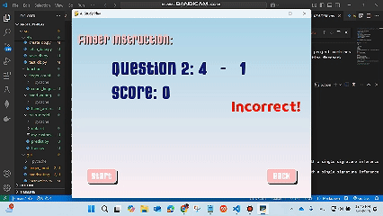
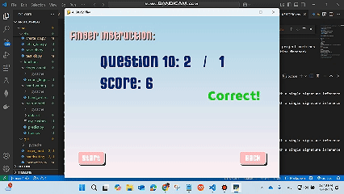

# AI Study Play 🎮

**AI Study Play** is an educational and interactive game developed with **Python**, **Pygame**, **OpenCV**, and **MediaPipe**. This project leverages AI-powered hand gesture and finger recognition to help users learn and practice basic math expressions in a fun and engaging way.

## Features 🌟

### Main Functionalities:
- **Instructions**: Clear and concise guide on how to play the game.
- **Settings**:
  - Adjust background music volume.
  - Adjust sound effect volume.
- **Exit**: Exit the game smoothly from the main menu.

### Game Modes:
1. **Hand Writing Mode** ✍️:
   - Players are presented with 10 random math expressions (e.g., 5 + 3).
   - Solve each expression by writing the result using hand gestures.
   - The system uses real-time pose estimation to detect handwriting in the air.
   - Scores are calculated based on the number of correct answers.

2. **Finger Counting Mode** ✋:
   - Players solve single-digit math problems (e.g., 4 - 2).
   - Show the result by holding up the correct number of fingers.
   - Finger count is detected using MediaPipe's hand tracking.
   - The system provides immediate feedback and encouragement.

- **High Score Board**:
   - After completing each mode, the score (out of 10) is saved into a **MySQLite** database.
   - Top scores are displayed in a leaderboard for both modes.

## Technologies Used 🛠️

- **Python**: Core programming language.
- **Pygame**: For creating the game's user interface and handling input.
- **OpenCV**: For capturing and processing live video feed.
- **MediaPipe**: For detecting hand gestures and finger positions.
- **MySQLite**: For storing and retrieving high scores locally.

- 🧠 Hand Writing Recognition with CNN

The Hand Writing Mode uses a Convolutional Neural Network (CNN) to recognize digits written in the air. After the player draws a number using hand gestures, the drawn image is processed and passed through a trained CNN model for classification.

The CNN model is built with the following architecture:

    ```bash
    model = tf.keras.Sequential([
    tf.keras.layers.Conv2D(32, (3, 3), activation='relu', input_shape=(28,28,1)),
    tf.keras.layers.MaxPooling2D((2, 2)),
    tf.keras.layers.Conv2D(64, (3, 3), activation='relu'),
    tf.keras.layers.MaxPooling2D((2, 2)),
    tf.keras.layers.Flatten(),
    tf.keras.layers.Dense(128, activation='relu'),
    tf.keras.layers.Dense(10, activation='softmax')
    ])
    ```

This CNN is trained to classify grayscale digit images (28x28 pixels) into one of the 10 digit classes (0–9). It enables the system to accurately interpret the player’s handwritten answers and compare them with the correct solution to each math expression.

- 🗃️ Custom Handwriting Dataset
To improve recognition accuracy in real-world scenarios, we did not use the MNIST dataset. Instead, we created a custom dataset by drawing and collecting over 200 handwritten digit samples ourselves. This helped the model better adapt to the actual writing styles captured from camera input.

If you would like to create your own handwriting dataset, you can follow this GitHub repository by our team member Phùng Trọng Duy:

[GitHub - Custom Handwriting Dataset Tool](https://github.com/duytrong03/Handwriting-Recognition-Demo.git)

## Installation and Usage 🚀

### Prerequisites:
- Python 3.8 or later
- Required libraries: `Pygame`, `OpenCV`, `MediaPipe`, `sqlite3` (built-in)

### Steps to Run:
1. Clone this repository:
    ```bash
    git clone https://github.com/phamchivy/AI-Study-Play.git
    ```
    ```bash
    cd AI-Study-Play
    ```

2. Install dependencies:
    ```bash
    pip install -r requirements.txt
    ```

3. Run the game:
    ```bash
    cd src

    python main.py
    ```

## Screenshots 📸
Watch the full video demo: [Google Drive Video](https://drive.google.com/file/d/1gcU7rLEBV7c33wXuV0iNj9-DzVFcEl3C/view?usp=sharing)

- **Hand Writing Mode**:

  

- **Finger Counting Mode**:

  

- **High Score Board**:

  

## Future Improvements 🚧
- Add more math difficulty levels (2-digit, 3-digit expressions).
- Enhance handwriting recognition accuracy with machine learning.
- Add voice guidance and feedback for younger users.
- Support multilingual instructions and UI.
- Add user profiles and performance tracking over time.

## Contributions 🤝

- Discord Football Team.
- Phạm Chí Vỹ - Captain - Technical Lead.
- Phùng Trọng Duy - Technical Member.

# Learn math, play smart — have fun with AI Study Play!
