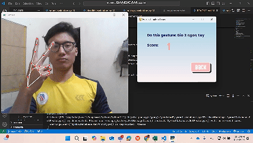
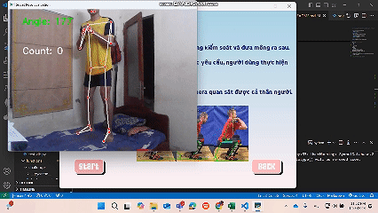
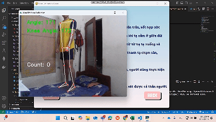
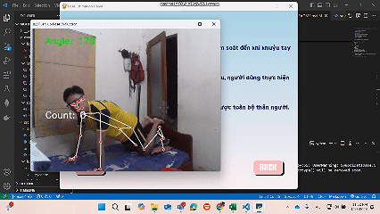
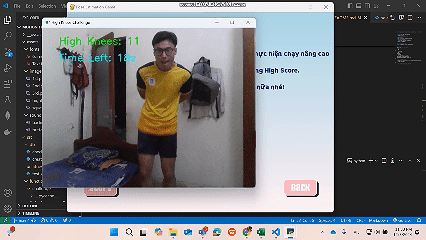

# Pose Estimation Game 🎮

A **Pose Estimation Game** built using **Python**, **Pygame**, **OpenCV**, and **MediaPipe**. This project combines fitness and fun by leveraging pose estimation technology to provide interactive gameplay and real-time feedback.

## Features 🌟

### Main Functionalities:
- **Instructions**: Clear guidance on how to play the game.
- **Settings**: 
  - Adjust background music volume.
  - Modify sound effect volume.
- **Exit**: Seamlessly exit the game from the menu.

### Game Modes:
1. **Rehabilitation Mode**:
   - Designed for hand rehabilitation.
   - Players perform specific hand actions as instructed by the game.
2. **Gym Mode**:
   - Focuses on three main exercises:
     - **Squat**: Track your squat technique and improve your form.
     - **Deadlift**: Get real-time feedback on deadlift posture.
     - **Push-Up**: Count and evaluate your push-up performance.
3. **Challenge Mode**:
   - Play **High Knees** for 30 seconds.
   - Compete for the best score and track top results in the **High Score Board**.

## Technologies Used 🛠️

- **Python**: The core programming language.
- **Pygame**: For creating the game's user interface and interactivity.
- **OpenCV**: For video processing and real-time camera feed integration.
- **MediaPipe**: For accurate pose estimation and movement detection.

## Installation and Usage 🚀

### Prerequisites:
- Python 3.8 or later
- Required libraries: `Pygame`, `OpenCV`, `Mediapipe`

### Steps to Run:
1. Clone this repository:
    ```bash
    git clone https://github.com/phamchivy/Motion-checking.git
    ```
    ```bash
    cd Motion-checking
    ```
2. Install dependencies:
    ```bash
    pip install -r requirements.txt
3. Run the game:
    ```bash
    python main.py
## Screenshots 📸
This is the results I've test all of the funtions of the game. The full video: (https://drive.google.com/file/d/19BRLmrQ5CQXQ5wgxSPGnWzQH6eOcEslp/view?usp=sharing).
- Rehabilitation Mode:


- Squat Mode:


- Deadlift Mode:


- Push up Mode:


- Challenge Mode:


## Future Improvements 🚧
- Add more exercises and rehabilitation activities.
- Enhance leaderboard functionality with user profiles.
- Support multiplayer or online competition modes.
- Improve the settings menu with additional customization options.
- Add more languages for a broader audience.
<!--
## Known Issues 🐞
    Document any known bugs or issues here.
-->
## Contributions 🤝
- I would like to express my gratitude to **Mr. Hoang Quang Huy** for teaching me C++ and providing invaluable feedback on this project. Your guidance has been instrumental in shaping both my skills and this project. Thank you for your support and encouragement!
- Thenkiu **Công chúa Jang** đã 'quấy nhiễu' và giúp tớ chọn giao diện siuuuuuuu dễ thương ạ (như cậu) 🌸.
<!--
## License 📄
    Specify the license under which your project is distributed.
-->
# Enjoy the game and level up your fitness while having fun!


